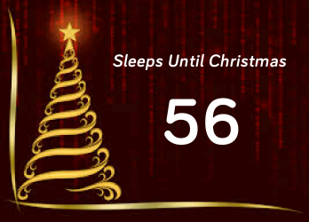

# FitbitXmasTimer
Code for my Fitbit app: Countdown to Christmas.

This is my first Fitbit app. It displays the number of days counting down until next Christmas. On Christmas day, it will display a festive message! The code is written in JavaScript, and is available in the Fitbit App Gallery under the name `Xmas Timer`.

The app gets the current date and subtracts it from Christmas day (25-12). There is a corner case whereby if the date is after christmas and yet before New Years Day, it subtracts from the Christmas of the following year. 

### Screenshots

